# Welcome to Peri Path 👋

# Table of Contents
1. [Get started](#get-started)
2. [Project Stucture](#project-stucture)
3. [Tests](#tests)
4. [How to use the app](#how-to-use-the-app)
5. [I have symptoms I want to document today. How do I track symptoms?](#i-have-symptoms-i-want-to-document-today)
6. [What do the dots in the Calendar mean](#what-do-the-dots-in-the-calendar-mean)
7. [I’m going to the doctor and I want to show the doctor recent data](#im-going-to-the-doctor-and-i-want-to-show-the-doctor-recent-data)
8. [I want to learn more about perimenopause](#i-want-to-learn-more-about-perimenopause)
## Get started
1. Clone this project 

2. cd into this project 

3. Install dependencies

   ```bash
   npm install
   ```

4. Start the app

   ```bash
    npm start
   ```
5. Install the expo app on your mobile device 

6. Scan the QR code with your phone and the project will open in the expo app

## Project Structure 
```
── README.md
├── TODO.md
├── __mocks__ **A pretend async storage used for testing**
│   └── @react-native-async-storage
│       └── async-storage.js
├── app
│   ├── (tabs) **Each screen in the app**
│   │   ├── analysis.js
│   │   ├── calendar.js
│   │   ├── home.tsx
│   │   ├── learn.js
│   │   ├── profile.js
│   │   ├── settings.js
│   │   └── track.js
│   ├── +not-found.tsx
│   ├── _layout.tsx **The root of the app where navigation and screen headers are defined**
│   ├── settings-context.tsx **Defined and handles the switching of user settings like large text or high contrast**
│   └── widgets **reusable stylised components** 
│       ├── TabButton.js
│       ├── TableRow.js
│       ├── analysis 
│       │   ├── analysis-wigi.tsx
│       │   ├── cycle-length.js
│       │   ├── getLastPeriodStartDate.ts
│       │   ├── last-period.tsx
│       │   ├── most-common-symptom.tsx
│       │   ├── period-chart.js
│       │   ├── period-length.js
│       │   └── symptom-chart.js
│       ├── calendar
│       │   ├── day-box.js
│       │   ├── month.js
│       │   └── two-week.js
│       ├── nav.tsx
│       └── track
│           ├── MostCommon.js
│           ├── PeriodSquare.js
│           └── Slider.js
├── app.css
├── app.json
├── articles.json **The articles used in learn**
├── articles.schema.json
├── assets
│   ├── fonts
│   │   └── SpaceMono-Regular.ttf
│   └── images
│       ├── adaptive-icon.png
│       ├── favicon.png
│       ├── icon.png
│       ├── partial-react-logo.png
│       ├── react-logo.png
│       ├── react-logo@2x.png
│       ├── react-logo@3x.png
│       └── splash-icon.png
├── components
│   ├── __tests__ **All the JEST Tests**
│   │   ├── Analysis-test.tsx
│   │   ├── Calendar-test.tsx
│   │   ├── Home-test.tsx
│   │   ├── Learn-test.tsx
│   │   ├── MostCommon-test.tsx
│   │   ├── PeriodSquare-test.tsx
│   │   ├── Slider-test.tsx
│   │   ├── TabButton-test.tsx
│   │   ├── Track-test.tsx
│   │   ├── TwoWeek-test.tsx
│   │   └── __snapshots__
│   │       └── TabButton-test.tsx.snap
│   └── setup **Testing setup definitions and specifications** 
│       └── jest.setup.js
├── eas.json
├── expo-env.d.ts
├── package-lock.json
├── package.json **Defines versions of packages used and dependencies** 
├── symptoms.json **List of symptoms used throughout the app** 
├── symptoms.schema.json
├── tsconfig.json
└── userdata.schema.json 
```

## Tests 
Run `jest` in the root of the project to run the tests which are located in `components/__tests__`. The mocked components are in `__mocks__/` and the setup for JEST testing is defined in `components/setup/jest.setup.js`

## How to use the App 
A few customer user journeys will be presented along with step-by-step instructions and screenshots to show how the app can be used. 

### I have symptoms I want to document today
How do I track symptoms?

#### 1. Start at the home page 


#### 2. Press the Track Button 
The Track button is located at the bottom of the screen in the middle and is green in color. 

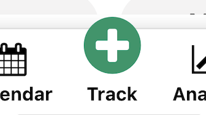

Pressing this button will take you to the track page

#### 3. Choose your symptoms 
You now have the choice between choosing symptoms from the six quick add buttons, or using the dropdowns to select other symptoms.

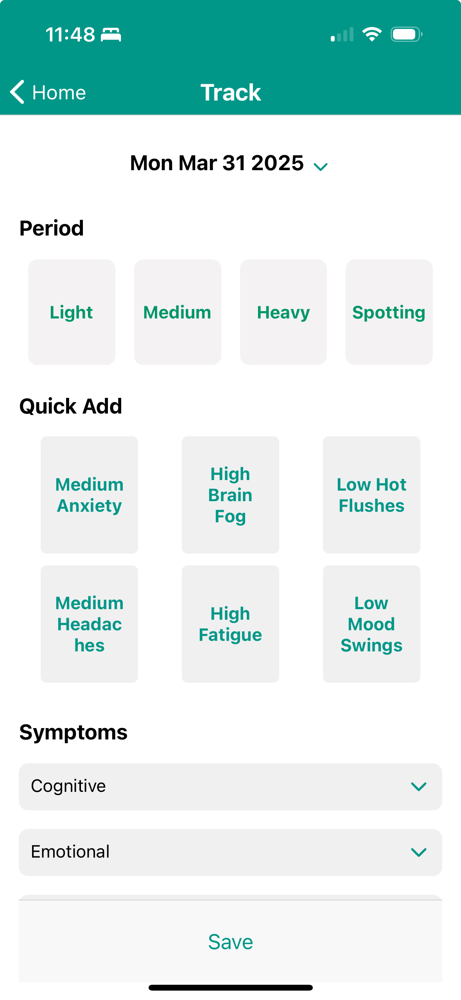

You will know when you have selected a quick add button because the background will change color. Multiple quick add buttons can be selected. 

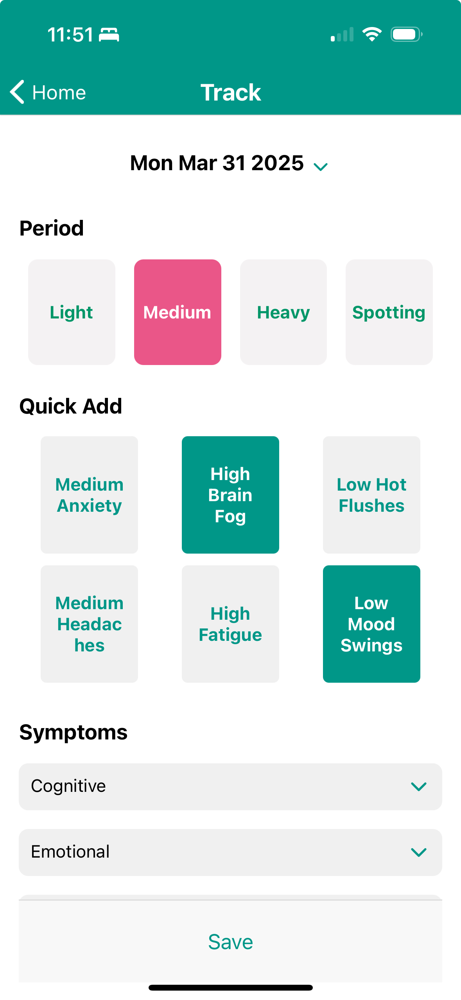

When using the sliders you have the choice of tracking the symptom as either None, Low, Medium, or Severe. 

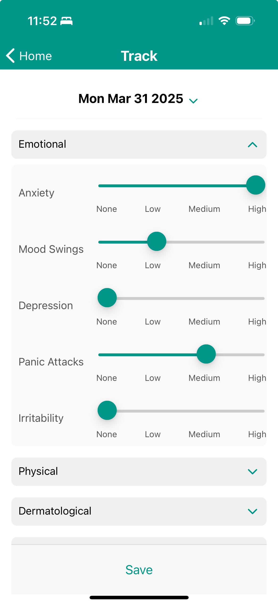


#### 4. Press Save 

**Important**: You must now press save otherwise your changes will not be saved. The save button is in green at the bottom of the screen. When you hit save you will be taken back to the Home screen.

#### 5. View the symptoms you tracked in the Calendar

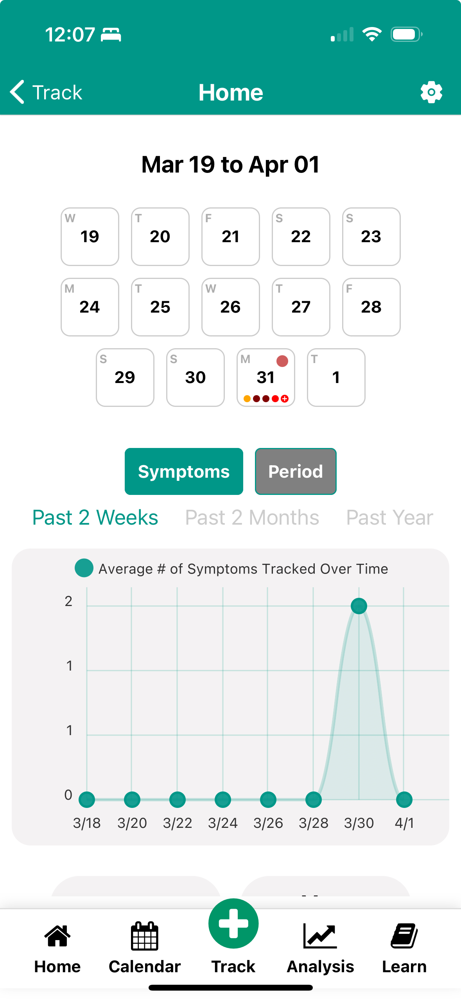

### What do the dots in the Calendar mean
After following the steps for [how to track symptoms](#i-have-symptoms-i-want-to-document-today), you can see in the calendar box for the 31st of March that there are now red dots. 

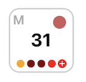

- The letter at the top left represents the day of the week (e.g. M for Monday).
- The red circle at the top right hand corner of the box represents any period data that has been tracked. The heavier the period the darker the color of the circle. 
- The smaller circles along the bottom of the day box represent the symptoms tracked and their severity. 
   - Yellow circle = Low severity
   - Bright red circle = Medium Severity 
   - Dark red circle = High severity 
   - Bright red with a plus = 5 or more than symptoms have been tracked

Details for that day can be found by clicking on the Calendar button in the navigation bar at the bottom and then clicking on the day you want to see details for. If you press the edit button you will be taken to the Track screen for that day. 

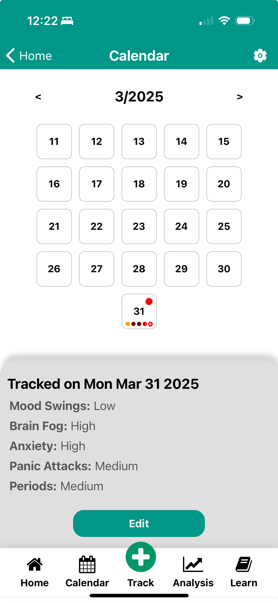

### I’m going to the doctor and I want to show the doctor recent data

#### 1. Go to settings
Starting at the Home page, press the settings button (a gear icon) in the top right of the screen. 


This will take you to the Settings Screen as shown below. 

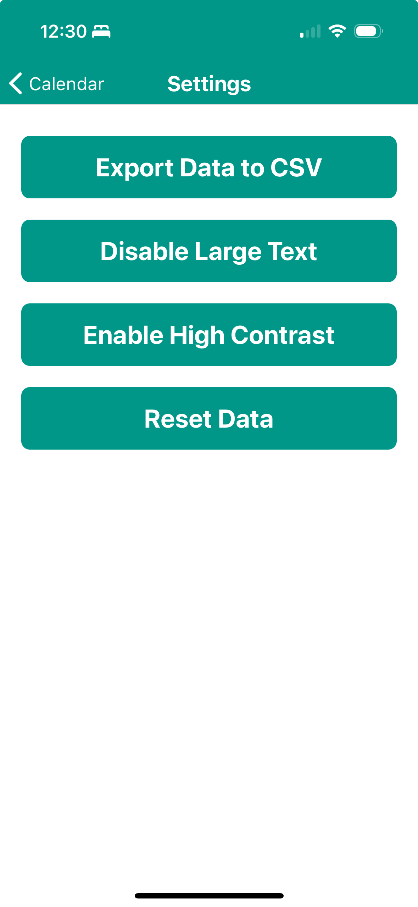

#### 2. Press Export Data to CSV Button
Press the first button on the screen titled `Export Data to CSV Button` and the following modal will popup on your screen asking how you would like to save the csv file.

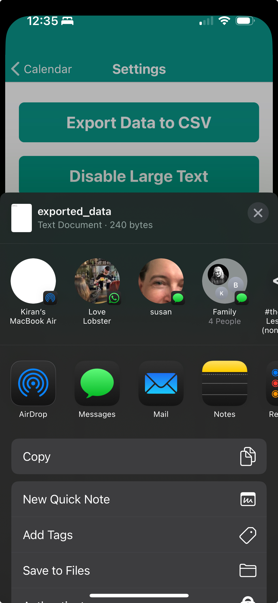

#### 3. Save the file 
There are many different options for saving the file. For the purpose of this example, press the `save to files` button as shown below. 

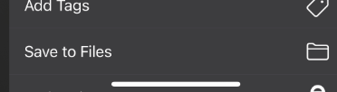

You can then hit save or specifcy a location within your file system before you save.

### I want to learn more about perimenopause

#### 1. Go to the Learn Screen
From the home page press the `Learn` button on the bottom right of the screen. 


#### 2. Go to the Perimenopause Tab
From the learn page, select the `Perimenopause` tab. 


#### 3. Browse Articles
This will display all the articles that relate to Perimenopause. All articles are handpicked from reliable sources. When you click on an article button, you will be taken directly to that site to read up on that topic in detail. 

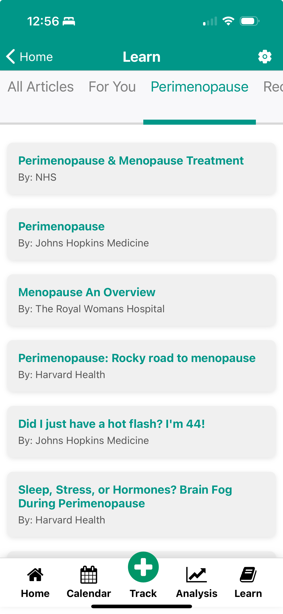
